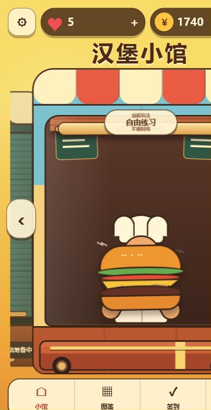
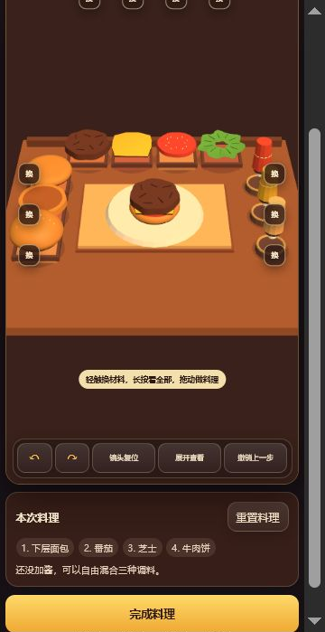
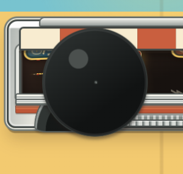

# 汉堡本体与餐车卡片美术评估

日期：2026-07-27  
评估范围：当前 `main` 分支首页汉堡、3D 料理台成品，以及用户补充的黑色圆坨截图。

## 总体结论

当前问题不是单纯的“精细度不够”，而是三套视觉表达没有统一：

1. 首页汉堡是 HTML/CSS 几何图形，像扁平贴纸。
2. 料理台汉堡由圆柱和旋转体拼接，像塑料积木。
3. 用户补充截图里的餐车更接近写实卡通，但出现了一个无语义的巨大黑色圆盘，遮住了出餐窗口。

因此只改颜色或加阴影不够，需要统一为“暖色美式餐车 + 手作黏土 3D”的一套造型规则。

## 证据

### 01：首页汉堡

健康度：较差

- 每层都是规则椭圆或多边形，轮廓过于整齐。
- 所有层都用同样粗的深色描边，读起来像图标，不像食物。
- 面包、生菜、番茄、芝士和肉饼没有体积、湿润感、融化感或接触阴影。
- 汉堡只是中央徽章，没有和餐车出餐窗口形成故事关系。
- 源码位置：`home.css` 的 `.hero-burger*`。

### 02：料理台四层成品

健康度：差

- 已放入下层面包、番茄、芝士、牛肉饼，但画面主要只读到一个深色圆饼。
- 番茄和芝士被压成很薄的色带，层次几乎消失。
- 肉饼顶部颜色太暗、面积太完整，成为“黑褐色圆盖”。
- 汉堡在餐盘上太小，镜头和操作台占了大部分注意力。
- 几何体主要来自规则圆柱、旋转体和均匀波纹；材质主要是单色 `MeshPhysicalMaterial`，缺少纹理、法线和局部颜色变化。
- 源码位置：`burger-model-3d.mjs` 的 `createBunGeometry`、`createCheeseGeometry`、`createLettuceGeometry` 和 `buildLayerDefinitions`。

### 03：用户补充的黑色圆坨

健康度：严重故障

- 从视觉上更像被错误放大的轮胎、轮毂或 AI 混合出来的煎锅/轮胎对象。
- 它没有任何可识别的游戏功能，完全遮住了出餐窗口和内部内容。
- 当前笔记本 `main` 分支无法复现这张图：现有首页是纯 HTML/CSS 餐车，轮子尺寸很小。因此它很可能来自另一张生成图、台式机未同步版本，或尚未提交的实验实现。
- 无论原意是什么，都不应保留。进入正式实现前应删除该对象，并检查台式机差异。

## 餐车卡片建议

采用用户确认的镜头流程：

1. 完整餐车从卡片右侧进入，先让玩家看清整车轮廓、发光门头和动态灯牌。
2. 车辆停稳后轻微回弹，轮胎停止转动。
3. 卡片内部镜头向出餐窗口推进，最终只显示出餐台、菜单灯箱、厨师和汉堡。
4. 轮胎、保险杠和车身下半部必须被卡片遮罩裁掉，不能穿过或覆盖出餐窗口。
5. 动态灯牌在车辆停稳后开始切换汉堡、薯条、饮料和套餐画面。
6. `prefers-reduced-motion` 下取消驶入和缩放，仅使用淡入与直接切换。

建议把餐车拆成独立视觉层：

- `truck-body`：车身与轮胎，始终处在下层。
- `service-window`：出餐窗口和台面。
- `menu-lightbox`：静态菜单灯箱。
- `flip-sign`：旋转/翻页/滚动画面的动态广告灯牌。
- `food-hero`：最终出现的主汉堡。

## 汉堡重做标准

- 面包：更宽、更松软，烘烤边缘和顶部芝麻清楚，不能像塑料圆盖。
- 肉饼：从近黑色改为暖棕色；外缘不规则；侧面有烤纹和肉粒感。
- 芝士：面积应超过肉饼，四角自然下垂，保持高饱和切达黄色。
- 番茄：改成两到三片可辨认切片，增加籽和湿润高光。
- 生菜：至少两层不规则褶皱，从汉堡边缘明显露出。
- 叠层：允许轻微错位，每一层都必须有可辨认的外轮廓和接触阴影。
- 镜头：使用偏低的三分之四视角，而不是近俯视；成品汉堡至少占料理画面高度的三分之一。
- 光照：暖色主光、较弱冷色补光和清楚的接触阴影，避免全局均匀发亮。

## 优先级

### P0

1. 删除黑色圆坨，确认它来自台式机差异还是生成图。
2. 餐车进场后只聚焦出餐窗口，轮胎层永远不能盖住窗口。
3. 放大料理台成品，并让番茄、芝士、生菜在普通视角下可见。

### P1

1. 重做面包、肉饼和芝士几何轮廓。
2. 增加局部色差、粗糙度变化、烤纹和接触阴影。
3. 统一首页汉堡与 3D 汉堡的比例、颜色和轮廓语言。

### P2

1. 加入动态菜单灯牌。
2. 增加餐车停稳、出餐灯亮起和汉堡上台的短动画。
3. 补充声音和轻量粒子反馈。

## 评估限制

- 黑色圆坨截图无法在当前笔记本 `main` 分支复现，所以不能从本地源码确认它的精确节点名。
- 本报告没有修改游戏逻辑或美术实现，只完成评估、证据整理和交接说明。

