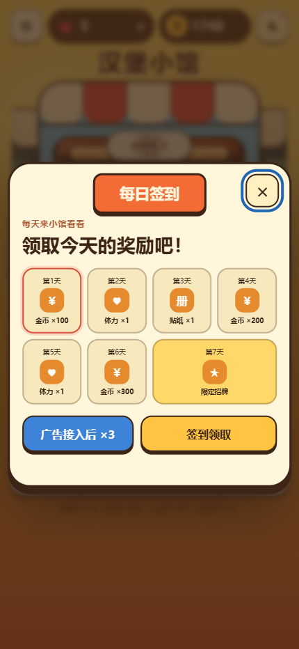
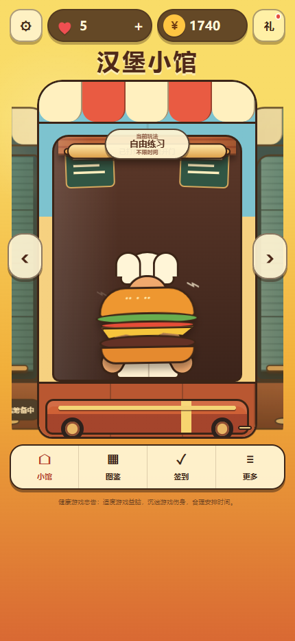
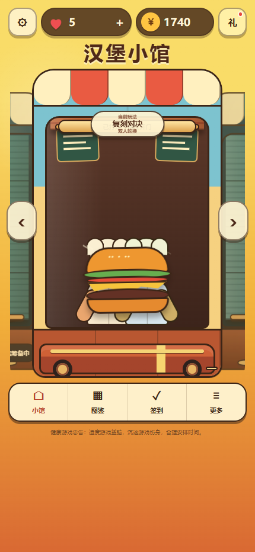
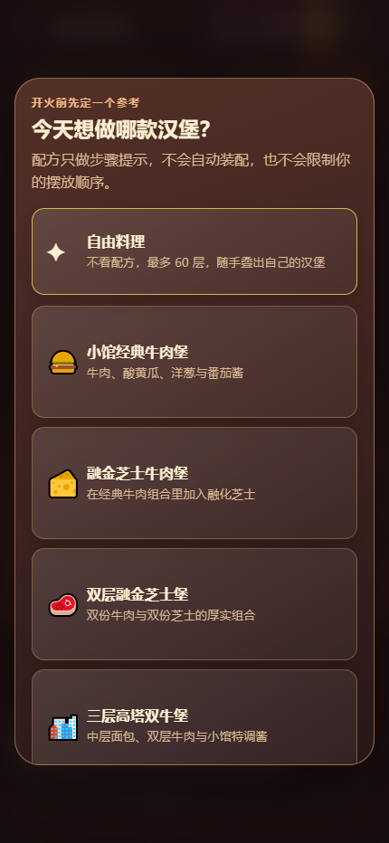
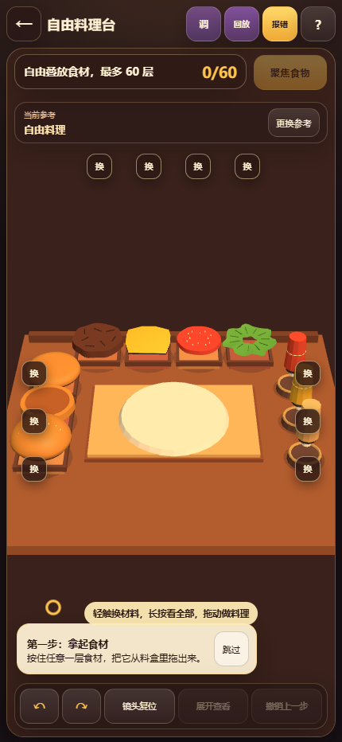
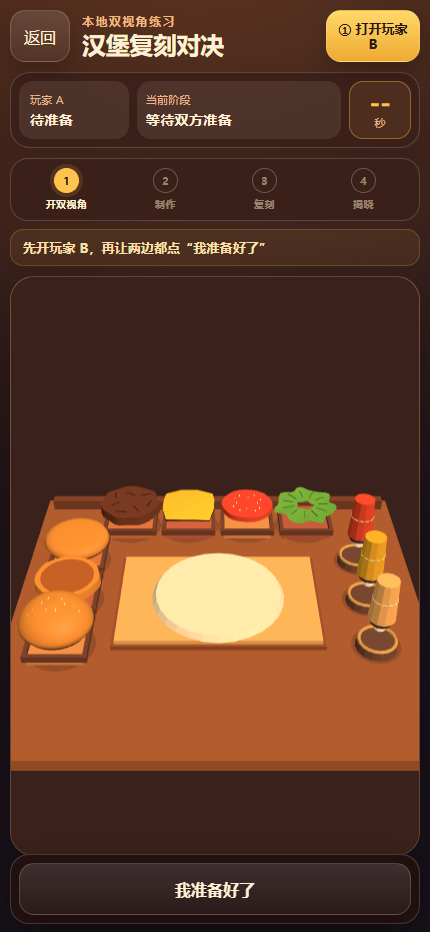
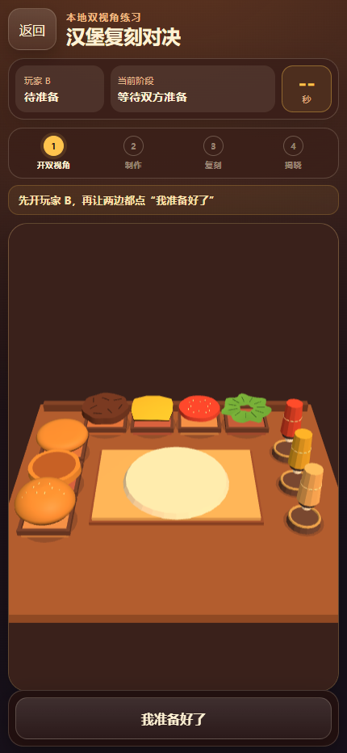
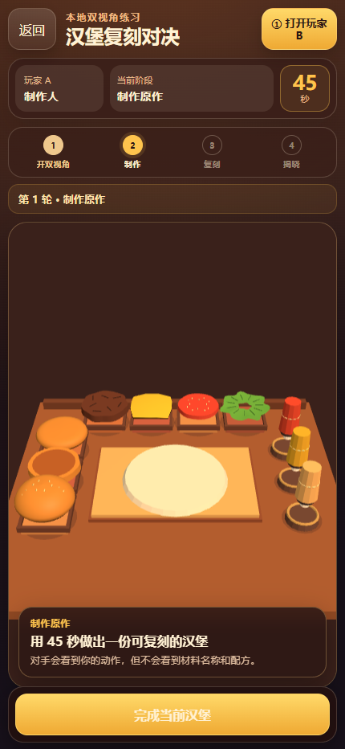
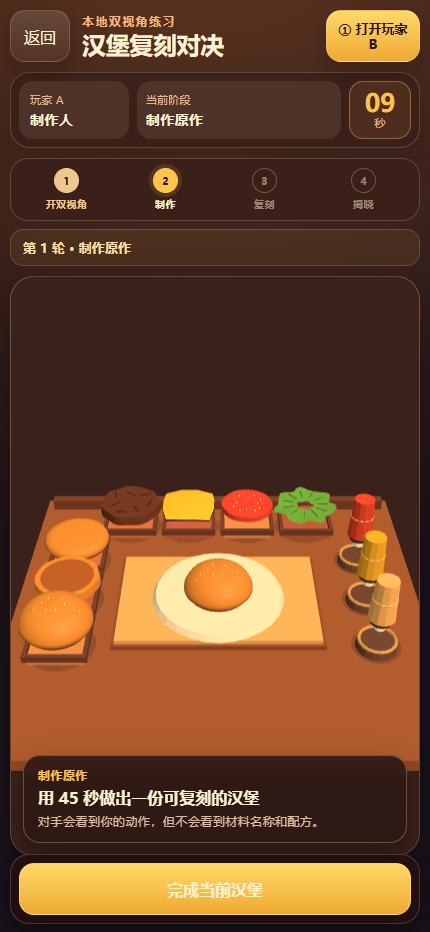

# 汉堡游戏交互与美术审计

审计对象：`https://kidcadillac.github.io/threejs_burger/`

审计视口：430 × 932（手机端）

审计范围：首次进入、首页模式选择、配方选择、3D 自由料理、双人复刻对决、玩家 B 加入、开局与食材拖拽。

## 总体判断

项目已经有可玩的核心：3D 食材能够被直接拖到餐盘，双人对决也有阶段、角色和计时状态。当前最大问题确实是交互与美术，但更准确地说，是“交互结构没有把已有玩法展示出来，美术又没有形成一套贯穿全程的语言”。玩家能看到一个有趣的汉堡小馆，却很难立即理解该点哪里、怎么切模式、为什么要开第二个页面，以及不同页面是否属于同一款游戏。

## 优点

- 汉堡餐车、卷帘门、厨师和汉堡角色构成了有记忆点的首页主题。
- 圆角、深色描边、黄橙棕色在单个页面内部较一致，移动端按钮尺寸普遍足够大。
- 3D 拖拽能够成功把食材吸附到餐盘，直接操作本身是对的。
- 双人页的四阶段进度、当前角色和 45 秒计时比单人流程更清楚。
- 本轮核心页面均正常加载，未发现会阻断体验的脚本错误；唯一控制台问题是首页 favicon 404。

## 分步审计

### 1. 首次进入：每日签到

健康度：一般

- 签到弹窗样式完整，标题、奖励和关闭按钮清楚。
- 玩家第一次打开游戏，还未理解核心玩法，就先被奖励弹窗截断。
- “广告接入后 ×3”和“签到领取”视觉权重接近，前者看起来像已可用的主要动作。
- 奖励卡文字偏小，第 7 天卡片与其他卡片尺寸不同，扫描节奏不稳定。
- 关闭按钮的蓝色焦点圈对键盘可见性有帮助，但在视觉上比主操作更抢眼。

建议：首次新玩家完成第一局后再展示签到；或者把签到缩成首页角标，不要抢占第一次体验。

### 2. 首页：自由练习

健康度：较差

- 首页插画有辨识度，汉堡角色和餐车结构是目前最像“品牌”的部分。
- 主卡更像海报而不是按钮。画面没有明确的“开始自由练习”CTA，玩家不知道卷帘门或整张卡可以点击。
- 左右箭头明确表达“切店”，但没有任何同等级提示表达“上下滑切玩法”。
- 顶部资源、店名、模式牌、餐车、底部导航同时争夺注意力，真正的下一步反而最弱。
- 健康提示文字过小，已经接近不可读。

建议：保留餐车主题，但在卡片底部增加明确的主按钮，如“开始自由练习”；模式选择改为可见标签或分页点。

### 3. 首页：切换到复刻对决

健康度：较差

- 上滑确实能切换到“复刻对决”，人物也从单人变为双人。
- 状态变化只体现在顶部很小的模式牌和被汉堡遮挡的人物上，反馈太弱。
- 同一块卡同时承载横滑、竖滑和点击三种手势，手势冲突且几乎无法自发现。
- 视觉上仍然没有“开始复刻对决”的清晰入口。

建议：把玩法做成显式的横向标签或卡片按钮，滑动只作为快捷方式，不能作为唯一入口。

### 4. 配方选择

健康度：一般

- 配方名称和说明可读，整张卡可点，选择目标足够大。
- 页面从明亮卡通餐车突然切换为暗棕色工具界面，像进入了另一款游戏。
- 图标混用了闪光符号、像素汉堡、芝士、肉块和城市 emoji，没有统一美术风格。
- 五张大卡需要滚动，最后一张在首屏被裁切，但没有明显滚动提示。
- 弹层没有明显返回或关闭动作，容易让玩家觉得被困在选择页。

建议：配方卡改成两列或横向浏览；使用同一套食物插画；保留首页品牌头部与明亮主色。

### 5. 3D 自由料理台

健康度：一般偏差

- 食材围绕餐盘摆放，符合“料理台”心智；直接拖拽是正确的核心操作。
- 屏幕中上部存在大面积无内容的深棕空区，食材和餐盘被压在屏幕下半部分，美术资产没有成为视觉主角。
- 所有替换按钮都只写“换”，玩家无法在不尝试的情况下知道会换什么。
- “轻触换材料，长按看全部，拖动做料理”同时要求记住三套手势，认知负担过高。
- 顶部“参数、回放、投稿、帮助”等工具在第一局就全部出现，压过了核心做菜动作。
- 食材材质偏塑料和基础几何，缺少统一的粗糙度、油亮度、烘烤纹理、阴影与接触感。
- 首页的厨师与汉堡角色在核心玩法中完全消失，品牌情绪没有被延续。

建议：重新构图，让餐盘和食材占据屏幕中心 60%；食材槽直接显示名称；首局隐藏高级工具；加强落点高亮、拖拽影子、吸附动画和成功反馈。

### 6. 双人复刻对决入口

健康度：一般

- 四阶段流程、玩家状态和准备按钮比首页清楚。
- “打开玩家 B”是整个玩法成立的关键，却依赖弹出新页面；在移动浏览器里可能被拦截，也要求玩家理解标签页切换。
- 画布同样存在大面积空区，餐盘和食材显得小。
- “玩法说明（30 秒看懂）”存在于文本结构中，但首屏视觉上不够明显。

建议：先明确产品模型。若是双设备玩法，使用房间码、二维码或分享链接；若是同设备轮换，改成明确的“把手机交给玩家 B”交接流程，不要依赖第二标签页。

### 7. 玩家 B 页面

健康度：较差

- 玩家 B 页面能够正常打开并加入同一局。
- A、B 两个页面几乎完全一样，只有很小的“玩家 A/B”文字变化，切换标签页后很容易认错身份。
- 页面没有独立的玩家颜色、头像、边框或全屏身份提示。
- 用户打开 B 后，没有明确提示如何回到 A，也没有告诉玩家应该在同一设备还是另一设备操作。

建议：为 A/B 使用稳定的两套身份色和头像；加入明确的交接或分享步骤；每次切换阶段都显示全屏角色提示。

### 8. 双人开局

健康度：一般

- 双方准备后，角色、阶段和倒计时能同步变化；“制作人 / 观察者”说明比入口清楚。
- 45 秒倒计时在双方刚准备完成时立即开始，玩家若还在切标签页或交接设备，会直接损失时间。
- 底部说明卡遮住了一部分料理台，进一步压缩了操作区域。
- “完成当前汉堡”按钮和计时器清楚，但缺少暂停、准备确认或三秒倒计时。

建议：双方准备后增加 3 秒开场倒计时；在角色交接期间暂停计时；说明卡首次出现后自动收起。

### 9. 拖拽食材

健康度：一般

- 底层面包能够顺利被拖到餐盘并自动吸附，核心机制可用。
- 成功反馈主要依赖“食材位置变了”，没有明显的层数变化、落点闪光、音效状态或短文案确认。
- 在倒计时压力下，食材没有可见名称，误拿后缺少明显、低成本的纠错入口。
- 面包与餐盘的接触阴影较弱，食材像悬浮或摆在平面贴图上，降低了“真实做汉堡”的满足感。

建议：加入落点环、吸附弹性、接触阴影、层数计数和撤销反馈；选中或长按时显示食材名，而不是让玩家记住位置。

## 最高优先级问题

### P0：先修交互结构

1. 首页同时承担“切店、切模式、开店、开始游戏”，但四件事没有清楚分层。
2. 双人模式依赖第二标签页，缺少稳定的设备与玩家交接模型。
3. 料理台把标签、提示和反馈藏起来，只剩手势记忆；新玩家难以形成操作信心。

### P1：建立统一美术语言

1. 首页 CSS 卡通、配方 emoji、料理台低模 3D、暗棕工具 UI 像四套产品。
2. 建议确定“温暖餐车 + 手作黏土 3D”作为统一方向：黄橙棕主色、深色描边、柔和接触阴影、统一食物插画与图标。
3. 把厨师和汉堡角色带入料理台，负责教程、反馈、成功/失败表情，使角色成为贯穿体验的品牌资产。
4. 统一食材材质：面包要有烘烤与芝麻，肉饼要有焦痕和粗糙度，芝士要有柔软边缘，酱料要有光泽和流动感。

### P2：再做视觉与可访问性整理

1. 统一字体层级、按钮高度、边框粗细和圆角等级。
2. 替换 emoji 与文本符号，使用同一套正式图标和食物资产。
3. 为模式切换提供可见控件，为动效提供“减少动态效果”选项，为倒计时提供合理的准备缓冲。
4. 继续做键盘、屏幕阅读器、缩放和真机触控测试；本次截图不能证明完整 WCAG 合规。

## 建议的改版顺序

1. 先重做首页信息架构和显式“开始游戏”按钮。
2. 决定双人是“两设备联机”还是“同设备轮换”，重做加入与交接流程。
3. 重新构图料理台，放大食材与餐盘，补齐名称、拖拽和吸附反馈。
4. 制定一页美术规范，再统一图标、角色、食材材质和页面色彩。
5. 最后处理签到、工具栏、说明文案和可访问性细节。

## 证据边界

- 本轮完成了手机尺寸的真实浏览器截图、模式滑动、玩家 B 加入、双方准备和一次食材拖拽。
- 没有完成整局计分、揭晓、声音质量、不同手机性能、屏幕阅读器和真机多指触控测试。
- 结论不能视为完整的无障碍合规声明。
